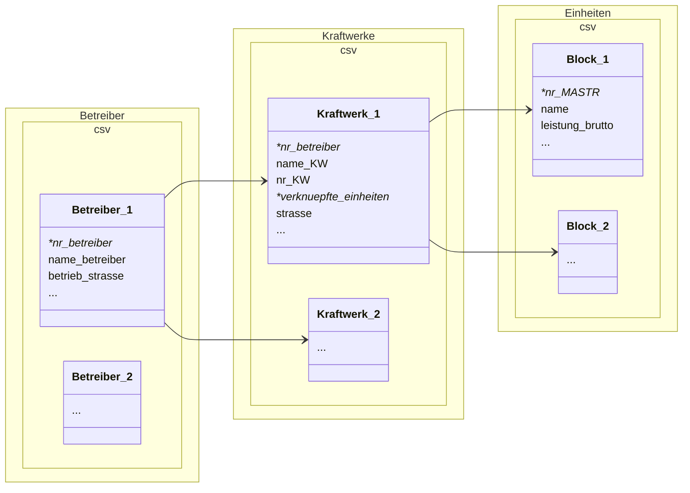

# IWH-STARK

Aus dem Projekt zur [Evaluation des "Kohlekompromisses"](https://www.iwh-halle.de/forschung/projekte/evaluierung-des-invkg-und-des-bundesprogrammes-stark) (InvKG & KVBG) des IWH Halle


**Fragen**:

- Welche Stein-/Braunkohlekraftwerke werden in den Revieren abgeschaltet?
  - Welche wurden im Rahmen des KVBG kompensiert?
- Was entsteht an neuen Kraftwerken in den Revieren (Gas / Wind / PV / Biomasse)?
  - Welche davon gehören zu Konzernen, die davor viel mit Kohle verbunden waren (LEAG, RWE, etc)


**Inhaltsverzeichnis**

 * [Datenquellen](#datenquellen)
 * [Datensätze](#datensätze)
       - [Kraftwerke.csv](#kraftwerkecsv)
       - [Betreiber.csv](#betreibercsv)
       - [Einheiten.csv](#einheitencsv)
 * [Projektstruktur](#projektstruktur)
    + [Reproduktion](#reproduktion)
    + [Codedateien](#codedateien)


## Datenquellen

- Marktstammdatenregister (MASTR): [Bundesnetzagentur](https://www.marktstammdatenregister.de/MaStR)
  - Online-Datenbank aller Energieerzeuger, Einheiten, Kraftwerke etc.
  - seit 2021 verpflichtend
- Kraftwerksliste (KWL): [Bundesnetzagentur](https://www.bundesnetzagentur.de/DE/Fachthemen/ElektrizitaetundGas/Versorgungssicherheit/Erzeugungskapazitaeten/Kraftwerksliste/start.html), basiert auf MASTR
  - umfasst alle Kraftwerke > 10MW, mit vielen händischen Nachbesserungen der BNetzA
  - aber hat trotzdem noch sehr viele Lücken
- Liste deutscher Braunkohletagebaue (LBKT): [Wikipedia](https://de.wikipedia.org/wiki/Liste_deutscher_Braunkohletagebaue#Weblinks)
- PLZ-Zuordnung zu Ort / BL (PLZ): [Postleitzahl.net](https://www.postleitzahl.net/plz-downloads)
- Kompensation für Kraftwerke (KVBG): [Anlage 2 KVBG](https://www.buzer.de/Anlage_2_KVBG.htm)
  - Liste an Kraftwerken, die nach dem KVBG abgeschaltet wurden / werden (und entschädigt werden)
- Fördergebiete / Reviere (INVKG): [§2 / §11 / §12 InvKG](https://www.vdivde-it.de/sites/default/files/document/Hinweisblatt-F%c3%b6rdergebiete_0.pdf)


## Datensätze

Es werden insgesamt 3 Datensätze bereitgestellt:

- `Kraftwerke.csv` beinhaltet alle Kraftwerke über 10 MW, die ins deutsche Netz einspeisen (also bspw auch solche aus dem Ausland). Ein Kraftwerk kann aus mehreren Einheiten / Blöcken bestehen, die in der Spalte `verknuepfte_einheiten` verlinkt sind.
- `Einheiten.csv` enthält genau diese Einheiten und genauere Informationen über sie, bspw. Koordinaten. Kann auch Einheiten enthalten, die unter 10 MW einspeisen, da auf Kraftwerksebene kumuliert wird
- `Betreiber.csv` beinhaltet alle Betreiber, die mit Anlagen vertreten als auch weitere Informationen zum Betrieb


Eine kleine schematische Darstellung der Zusammenhänge




#### Kraftwerke.csv

| ID                    | Beschreibung                                                 | Beispiel                                               |
| --------------------- | ------------------------------------------------------------ | ------------------------------------------------------ |
| nr_betreiber          | MASTR-Nummer des Betreibers (siehe auch `Betreiber.csv`)     | ABR999859507658                                        |
| nr_KW                 | Identifikator des Kraftwerks                                 | KWK914345641296                                        |
| name_KW               | Kraftwerksname (teilweise unvollständig!)                    | Neurath                                                |
| verknuepfte_einheiten | Stromerzeugungseinheiten, die zu dem KW gehören (einzelne Blöcke bspw) -> `Einheiten.csv` | SEE907150117643, SEE979012663285, SEE978971638464, ... |
| anzahl_einheiten      | Wie viele SEE gehören zu dem KW                              | 7 (Neurath Block A-G)                                  |
| energie_type          | Welche Art der Stromerzeugungstechnologie                    | Verbrennung                                            |
| leistung_brutto       | Kumulierte Leistung des KW                                   | 4440000                                                |
| energietraeger        | Unterkategorie des `energie_type`, bspw der Brennstoff       | Rohbraunkohlen                                         |
| stillgelegt           | Anteil des Kraftwerks, der stillgelegt ist im aktuellen Jahr | (von 7 Blöcken)                                        |
| jahr_inbetriebnahme   | Wann wurde (der **erste** Block des!) Kraftwerk in Betrieb genommen | 1972                                                   |
| jahr_stillgelegt      | Wann wurde (der **letzte** Block des!) Kraftwerk abgeschaltet | 2022                                                   |
| plz                   | Postleitzahl des Kraftwerks                                  | 41517                                                  |
| landkreis             | selbsterklärend                                              | Rhein-Kreis Neuss                                      |
| ort                   | =                                                            | Grevenbroich                                           |
| strasse               | =                                                            | Energiestraße                                          |
| hausnummer            | =                                                            | 101                                                    |
| bundesland            | =                                                            | Nordrhein-Westfalen                                    |
| stillegung_type       | Aus welchem Grund wurde das KW abgeschaltet                  | KVBG                                                   |
| KVBG_gebiet           | liegt es in einem Gebiet, das im KVBG erwähnt wird           | TRUE                                                   |
| Paragraph             | wenn `KVBG_gebiet=TRUE`, dann welher Paragraph (§2 / §11)    | §2                                                     |
| Revier                | Name des Reviers                                             | Rheinisches Braunkohlerevier                           |
| name_betreiber        | Name des Betreibers                                          | RWE Power AG                                           |
| konzerngruppe         | (selbsterstellte) Konzernübergruppe                          | RWE                                                    |

`nr_KW`: für verschiedene Arten der Energieerzeugung gibt es unterscheidliche IDs

- Verbrennung haben (oft) nach dem Muster `KWK012345...`
- Windparks einfach ihren Namen, bspw. `Windpark Cottbus Ost`
- Kernkraftwerke ihre nr_MASTR, `SEE012345...`
- Solarparks, Stromspeicher, Wasser, KEINE!


`stillegung_type` = Grund für die Stillegung

- "KVBG" = sowohl solche aus Anlage 2; dynamische Auscrheibungen bei BNA, als auch KVBG-Reserve
- "EnWG" = Stillegung nach §13 EnWG
- "reserve" = nach ENWG (Netz bzw Kapaittätsreservere), oder [besonderes netztechniches Betriebsmittel](https://de.wikipedia.org/wiki/Besondere_netztechnische_Betriebsmittel)
- "other" = ohne Angabe von Gründen oder vorläufig
- "NA" = noch in Betrieb


Information zur Aggregierung!:

- Die verschiedenen Einheiten eines Kraftwerks zu aggregieren ist ein messy prozess
- Bspw. werden nur das Jahr der Inbetriebnahme des frühesten Blocks übernommen
- und `stillgelegt` ist der Anteil an Blöcken, der gerade stillgelegt ist
- für genauere Informationen zu den einzelnen Blöcken, bitte in den Einzeldatensatz gucken

  

#### Betreiber.csv

| ID                 | Beschreibung                        | Beispiel                 |
| ------------------ | ----------------------------------- | ------------------------ |
| nr_betreiber       | MASTR-Numemr des Betreibers         | "ABR999859507658"        |
| name_betreiber     | Name des Betreibers                 | "RWE Power AG"           |
| betrieb_rechtsform | Juristische Rechtsform              | "AG"                     |
| betrieb_strasse    | Strassenname des Betriebsitzes      | "RWE-Platz"              |
| betrieb_hausnummer |                                     | "1"                      |
| betrieb_ort        | Ortsname                            | "Essen"                  |
| betrieb_plz        | Postleitzahl                        | "45141"                  |
| betrieb_web        | Website des Betriebs                | "https://www.group.rwe/" |
| konzerngruppe      | (selbsterstellte) Konzernübergruppe | "RWE"                    |

`konzerngruppe`: wird händisch erstellt. Muss bei Bedarf geupdatet werden, bspw wenn neue Anlagen mit neuen Unterfirmen angemeldet werden.


#### Einheiten.csv

| Variable         | Beschreibung / Kommentar                                | Beispiel                                        |
| ---------------- | ------------------------------------------------------- | ----------------------------------------------- |
| nr_MASTR         | Nr im MASTR                                             | SEE925599434282                                 |
| nr_betreiber     | Betreiber des Kraftwerks (unvollständig!)               | ABR999859507658                                 |
| energie_type     | Welche Art der Stromerzeugungstechnologie               | Verbrennung                                     |
| name             | Name der Einheit (unvollständig!)                       | Neurath F                                       |
| einspeisung      | Teil / Volleinspeisung                                  | Teileinspeisung (einschließlich Eigenverbrauch) |
| laenge           | Längengrad                                              | 6.612286                                        |
| breite           | Breitengrad                                             | 51.03765                                        |
| energietraeger   | Erdgas, Kohle etc                                       | Rohbraunkohlen                                  |
| nr_KW            | Kraftwerksnummer (unvollständig!)                       | KWK914345641296                                 |
| name_KW          | Kraftwerksname (unvollständig)                          | `NA`                                            |
| leistung_brutto  | Bruttoleistung in Megawatt                              | 1110000                                         |
| stillgelegt      | Einheit noch in Betrieb                                 | FALSE                                           |
| jahr_stillgelegt | wenn `stillgelegt=true`, auch mit Jahren in der Zukunft | 2030 (hier liegt es in der Zukunft!)            |
| plz              | =                                                       | 41517                                           |
| landkreis        | =                                                       | Rhein-Kreis Neuss                               |
| ort              | =                                                       | Grevenbroich                                    |
| strasse          | =                                                       | Energiestraße                                   |
| hausnummer       | =                                                       | 101                                             |
| laenge           | Längengrad                                              | 6.612286                                        |
| breite           | Breitengrad                                             | 51.03765                                        |
| stillegung_type  | siehe oben für Erklärung                                | KVBG                                            |

Geokoordinaten sind insbesondere für einzelne Windräder relevant, da sie im gleichen Windpark über große Distanzen ausgebreitet sein können


## Projektstruktur

Filetree der Dateien mit Kommentaren:

```
├── README.md                   # Diese Datei
├── data                   
│   ├── mastr                   # Marktstammdatenregister
│   │   ├── data                   # CSV Datensätze
│   │   └── mastr.db               # SQLite Datenbank
│   ├── processed               # Bereits verarbeitete daten
│   │   ├── 01_KWL_clean.csv
│   │   ├── ...
│   └── raw                     # Rohdaten
│       ├── Kraftwerksliste.xlsx
│       ├── ...
├── docs                        # PDFs etc
├── src                         # Codedateien
│   ├── 00_Runner.qmd
│   ├── 01_KWL_clean.qmd
│   ├── 02_PLZ_clean.qmd
│   ├── ...
├── iwh.Rproj                   # RStudio Projektdatei
├── .Rprofile                   # R Environment 
├── requirements.txt						# Python Packetliste 
├── renv.lock                   # R Packetliste

```

### Reproduktion

...ist wichtig. Deswegen sind die verwendeten Pakete mit `renv` (für R) und `venv` (für Python) aufgelistet. RStudio sollte die renv-Umgebung automatisch erkennen und anbieten alle Pakete runterzuladen. Alternativ im R-Terminal:

```R
renv::restore()
```

Für Python im normalen Terminal:

```
python -m venv .venv # Erzeugt ein Virtual environment
.venv\Scripts\activate.bat # nur für Windows
pip install -r requirements.txt # Herunterladen
```

Problem ist: dass sich das MASTR noch öfter ändern wird vermutlich. Irgendwann wird man da nochmal in die genauen Dateien reinschauen und Sachen abändern müssen. 


### Codedateien

